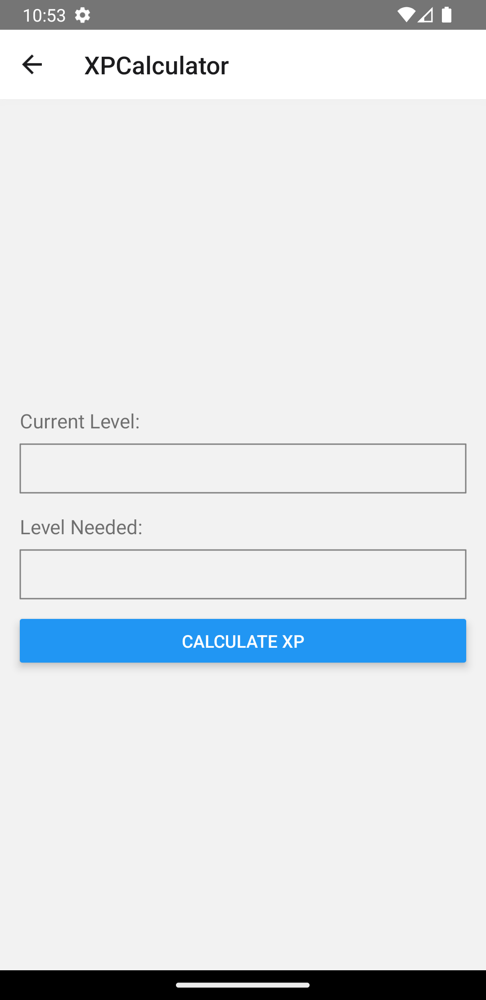

# Prezentare generală a aplicației Fortnite

## Ecrane

### 1 LoginScreen

LoginScreen este proiectat pentru autentificarea utilizatorului și include două câmpuri `TextInput` pentru numele de utilizator și parola. Sunt furnizate două butoane, Login și Register. Butonul "Login" utilizează o funcție callback pentru a prelua datele utilizatorului de pe un server JSON local și verifică dacă datele de identificare introduse se potrivesc cu vreun utilizator din baza de date. Butonul "Register" navighează către RegisterScreen.


### 2. RegisterScreen

RegisterScreen este dedicată înregistrării utilizatorilor și include două câmpuri `TextInput` pentru numele de utilizator și parola. Sunt furnizate două butoane, Register și Go To Login. Butonul "Register" utilizează o funcție callback pentru a trimite o cerere POST către serverul JSON local, creând un nou utilizator. Butonul "Go To Login" navighează către ecranul de autentificare.


### 3. Ecranul principal

MainScreen servește ca ecran principal al aplicației, afișând știrile Fortnite preluate din Fortnite API folosind o componentă `FlatList`. Fiecare știre este reprezentată de o componentă `View` cu o componentă `Text` în interior. Ecranul prezintă, de asemenea, trei butoane de navigare: NewToFortnite, FortniteShop și XPCalculator.


### 4. FortniteShopScreen

Acest ecran afișează articole din magazinul din jocul Fortnite folosind date preluate din API-ul Fortnite. Folosește un `ScrollView` pentru a prezenta articolele într-un aspect de tip grilă. Fiecare articol este reprezentat de o componentă `View` care conține o componentă `Image` și o componentă `Text`. Imaginile sunt preluate de la Fortnite API folosind URL-ul imaginii elementului.


### 5. NewToFortniteScreen

Acest ecran preia date despre noile articole cosmetice de la Fortnite API folosind o componentă `FlatList`. Fiecare element este afișat în cadrul unei componente `View` care conține o componentă `Image` și o componentă `Text`. Imaginile pentru fiecare element sunt preluate de la Fortnite API folosind URL-ul imaginii elementului.


### 6. XPCalculatorScreen

Acest ecran calculează XP-ul necesar și XP-ul pe zi pentru a ajunge la un anumit nivel în Fortnite. Dispune de câmpuri de introducere pentru nivelul actual și nivelul dorit, împreună cu un buton pentru a declanșa calculul XP. Valorile calculate sunt apoi afișate cu ajutorul unei componente `Text`.



## Navigare

Aplicația folosește `@react-navigation/stack` pentru a configura sistemul de navigare. Containerul de navigare este configurat în fișierul `AppNavigator.js`, care este apoi exportat și utilizat în fișierul principal `App.tsx`.

## <del>Managementul datelor

<del>Aplicația se bazează pe o bază de date locală JSON stocată în fișierul `users.json`. Acest fișier conține o matrice de obiecte utilizator cu proprietăți precum id și nume de utilizator. Funcționalitățile Login și Register interacționează cu această bază de date pentru autentificarea și, respectiv, înregistrarea utilizatorilor. În plus, datele pentru articolele din magazinul Fortnite, știrile și noile articole cosmetice sunt preluate din Fortnite API folosind funcția `fetch` cu cereri GET.
```
{
  "users": [
    {
      "id": "1",
      "username": "user1",
      "password": "password1"
    },
    {
      "id": "2",
      "username": "user2",
      "password": "password2"
    }
  ]
}
```
****

# Caz de Testare Manual pentru (XPCalculatorScreen)

1. **Deschiderea Aplicației:**
   - Deschide aplicația Fortnite.

2. **Navigare către Calculatorul XP:**
   - De pe ecranul principal, localizează butonul care spune "Go To XP Calculator" (sau similar).
   - Apasă butonul pentru a naviga către ecranul `XPCalculatorScreen`.

3. **Verificarea Aspectului Ecranului XPCalculatorScreen:**
   - Verifică dacă ecranul `XPCalculatorScreen` se afișează fără erori.
   - Asigură-te că există câmpuri de intrare pentru "Nivelul Curent" și "Nivelul Dorit" și un buton pentru calcularea XP.

4. **Introducerea Valorilor Valide ale Nivelului:**
   - În câmpul de intrare "Nivelul Curent", introdu un nivel de început valid (de exemplu, 10).
   - În câmpul de intrare "Nivelul Dorit", introdu un nivel țintă valid, mai mare decât nivelul curent (de exemplu, 20).

5. **Calculul XP:**
   - Apasă butonul "Calculează XP".

6. **Verificarea Calculului XP:**
   - Verifică dacă ecranul afișează valoarea XP calculată.
   - Asigură-te că XP-ul calculat este rezonabil în funcție de progresia XP-ului în Fortnite.

7. **Introducerea Valorilor Invalide ale Nivelului:**
   - În câmpul de intrare "Nivelul Curent", introdu o valoare de nivel invalidă (de exemplu, un număr negativ).
   - În câmpul de intrare "Nivelul Dorit", introdu o valoare de nivel invalidă (de exemplu, un nivel mai mic decât nivelul curent).

8. **Verificarea Gestionării Erorilor:**
   - Verifică dacă aplicația oferă mesaje de eroare adecvate sau gestionează cu eleganță intrările invalide.
   - Asigură-te că valoarea XP calculată rămâne neschimbată când se detectează o intrare invalidă.
